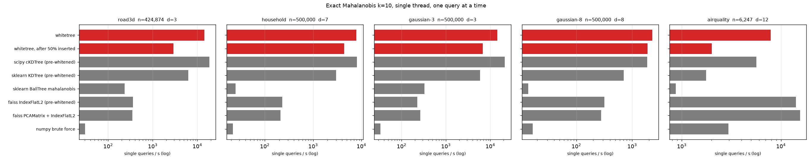
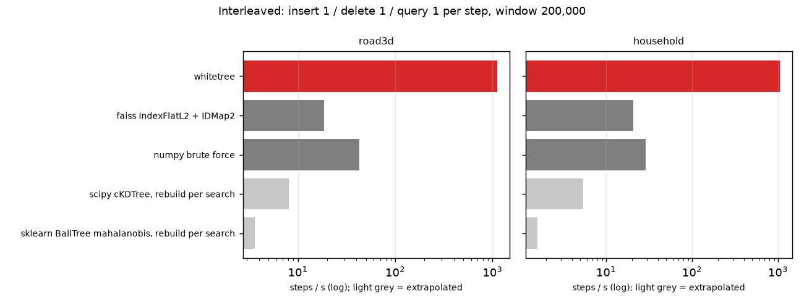

# whitetree

<p align="center"></p>

<p align="center"><strong>Exact nearest-neighbour search for sensor data. Updates without rebuilds.</strong></p>

# Intro

whitetree finds the records that look most like a new one. It is built for records that are a few numbers with different units that tend to move together, like (temperature, pressure, flow) from a sensor.

<p align="center"></p>

Plain Euclidean distance gives wrong neighbours on sensor records. The column with the biggest numbers wins, so pressure in pascals decides the answer and temperature barely counts. Scaling each column fixes the units but ignores the fact that temperature and pressure rise and fall together. Mahalanobis distance corrects for both the units and the correlation, and it is the standard distance for correlated measurements. Using Mahalanobis distance in Python is the hard part. scikit-learn makes you work out the inverse covariance matrix and pass it in yourself, and every tree index in scikit-learn and scipy has to be built again from scratch each time a new record arrives.

whitetree works out the covariance for you, gives exact answers (the same as a `scipy.spatial.cKDTree` built on the same data), and lets you add and remove records whenever you like without rebuilding anything.

## How it works

The name says it: whiten, then tree.

1. `fit(X)` works out the covariance and its Cholesky factor `L`, then multiplies every row by `L⁻¹`. After the multiplication, Mahalanobis distance between rows equals plain Euclidean distance, so the rows can go into a normal `scipy.spatial.cKDTree`.
2. `insert(x)` multiplies the new row by the same `L⁻¹` and drops it into a small buffer. Once the buffer holds 8 points, the buffer becomes a tiny tree. The trees are kept in order of size, and each tree has to be at least 32 times bigger than the next. When a new tree would be too big for its place, the new tree is merged with the smaller trees and rebuilt as one. As a result there are only 3 or 4 trees even with a million points, and the biggest tree almost never gets rebuilt.
3. `kneighbors(q)` multiplies the query by `L⁻¹`, searches the biggest tree first, and uses the k-th distance found in the biggest tree as a cutoff for the smaller trees, so the smaller trees are searched quickly.

Since the trees are plain cKDTrees, `workers=-1` runs queries on several cores. Each query reads one snapshot of the tree list, so queries can keep running while another thread inserts.

## Results

All numbers below are single-threaded, k = 10, and every answer was checked against float64 brute force. The datasets are public sensor logs from UCI. The full tables are in `docs/benchmarks.md` and the scripts are in `benchmarks/`.

**Searching a fixed dataset** (ann-benchmarks protocol, 500,000 points, one query at a time). On 3 to 7 dimensional sensor data, whitetree answers 8,000 to 14,000 queries per second. That is 40 to 300 times faster than scikit-learn's Mahalanobis BallTree, 7 to 60 times faster than FAISS IndexFlatL2, and about the same as whitening the data yourself and using scipy's cKDTree directly. FAISS can whiten too (`PCAMatrix`), but it estimates the covariance from a small sample in float32, so it misses 2 to 4% of the true neighbours, and on data with a big offset it returns NaN.



**Streaming** (big-ann-benchmarks streaming protocol). Keep a window of 200,000 points. At every step, insert one new point, delete the oldest one, and answer one query that has to see the point you just inserted. whitetree gets through about 1,100 steps a second. FAISS IndexFlatL2 manages about 20, because its delete scans the whole index. numpy brute force does 30 to 40. Rebuilding a scipy cKDTree or a scikit-learn BallTree for every query is slower than whitetree, FAISS and numpy.



## When to use it

whitetree is a good fit when the following four conditions are true:

- Each record is a handful of numbers, up to about 16, in different units or with columns that move together. Sensor channels, robot or vehicle state, GPS plus IMU, process measurements.
- You need the exact nearest records, not close enough.
- Records keep coming in (and maybe going out) while you keep asking questions, and the questions are mixed in with the updates rather than saved up for after them.
- You have at least 20,000 records and expect to run at least 10,000 queries.

Typical jobs: comparing a machine's current state with its own history inside a control loop, spotting odd readings in a live sensor stream, finding past paths that look like the one a robot is on now, catching duplicate measurements as they get logged.

whitetree is the wrong tool in four situations. If updates come in big batches with lots of queries in between, just rebuilding a `scipy.spatial.cKDTree` after each batch is simpler and faster. Under 20,000 records, a flat scan (`faiss.IndexFlatL2`) wins. Past about 32 dimensions, KD-trees stop helping; use FAISS or hnswlib. And right after a run of inserts, single queries run at 20 to 80% of full speed because they have to look in 2 or 3 trees; `consolidate()` merges them and gets the speed back.

## Check your installation

Two scripts check that the library works on your machine with your versions of numpy and scipy. The first inserts and deletes records in lots of different patterns and compares every answer with a `scipy.spatial.cKDTree` built on the same points, including ties, empty indexes, `k` bigger than the index, and agreement with scikit-learn's Mahalanobis BallTree. The second runs several query threads while another thread inserts, deletes and re-fits, and makes sure no query ever comes back with a broken or missing answer. Both finish with `all checks passed`.

```
pip install .[test]
python tests/test_dynamic_kdtree.py
python tests/test_concurrency.py
```

## Usage

```
pip install whitetree
```

```python
from whitetree import MahalanobisIndex

idx = MahalanobisIndex().fit(X)      # works out the covariance
d, i = idx.kneighbors(q, k=5)        # (nq, k) distances and ids
pid = idx.insert(new_row)
idx.delete(pid)

idx.consolidate()                    # merge the trees into one
idx.drift()                          # 0.0 means the fitted covariance still matches recent data
idx.refit()                          # estimate it again and rebuild
```

Python 3.10 or newer. Needs numpy and scipy, nothing else. `examples/streaming.py` is a full example, `docs/api.md` lists every parameter and method, and `docs/design.md` explains the design and the measurements behind it.

## Details

The package is `whitetree`. The class you import from it is `MahalanobisIndex`, named after the distance it computes. Its methods:

- `fit(X)` estimates the covariance from `X` (n rows, d columns), whitens the rows and builds the index. It raises an error on NaN, inf, constant columns or fewer than 2 rows, and warns when the covariance is close to singular. Pass `cov=` to use your own covariance instead.
- `kneighbors(q, k=5, workers=-1)` returns the `k` nearest records for one query or a batch of queries, as `(distances, ids)` arrays of shape `(nq, k)`. The distances are Mahalanobis distances. Safe to call from several threads at once.
- `insert(row)` adds one record and returns its id. `insert_many(rows)` adds a batch. Ids count up from 0 in the order records were added and are never reused.
- `delete(id)` removes one record. `delete_many(ids)` removes a batch in one go. Both report what was actually removed; deleting an id that is not there is not an error.
- `consolidate()` merges the internal trees into one. After a run of inserts, merging brings query speed back to full. You can keep inserting after a merge.
- `drift()` tells you how far the covariance from `fit` has drifted from the most recent `cov_window` records. 0.0 means the covariance still fits. `refit()` estimates the covariance again from the most recent `cov_window` records and rebuilds the index. Set `refit_threshold=0.35` to make `refit()` run automatically. Automatic refit is off by default because a rebuild pauses the stream, about 1.8 seconds at 2 million points.
- `len(idx)` is the number of live records.

Constructor options: `cov=None` (covariance; estimated when None), `reg=1e-9` (ridge, relative to the data scale), `shrinkage="auto"` (Ledoit-Wolf shrinkage, only when there are fewer than 5d rows), `dynamic=True` (False gives a plain static index), `size_ratio=32` and `micro_size=8` (tree layout), `cov_window=100_000`, `refit_threshold=None`, `check_every=10_000`.

What you can count on: distances match a `scipy.spatial.cKDTree` exactly after any mix of inserts and deletes. Which of two records at the same distance comes first is not guaranteed. One thread can write while any number of threads read.

`DynamicKDTree` is the plain Euclidean index underneath. You can use it directly if your data is already whitened. Full signatures for both classes are in `docs/api.md`.

## Reference

To cite whitetree:

```
@software{choi2026whitetree,
  title  = {whitetree: exact Mahalanobis nearest-neighbour search with insert and delete},
  author = {Juhyuk Choi},
  year   = {2026},
  url    = {https://github.com/whitetree-dev/whitetree}
}
```

None of the parts of whitetree are new. Whitening with a Cholesky factor is textbook. The covariance shrinkage is from Ledoit and Wolf (2004), *A well-conditioned estimator for large-dimensional covariance matrices*. The tree layout is the logarithmic method from Bentley and Saxe (1980), *Decomposable searching problems I*, with level sizes set the way LSM trees do it. The benchmarks follow [ann-benchmarks](https://github.com/erikbern/ann-benchmarks) and the [big-ann-benchmarks](https://github.com/harsha-simhadri/big-ann-benchmarks) streaming track.

## License

MIT
